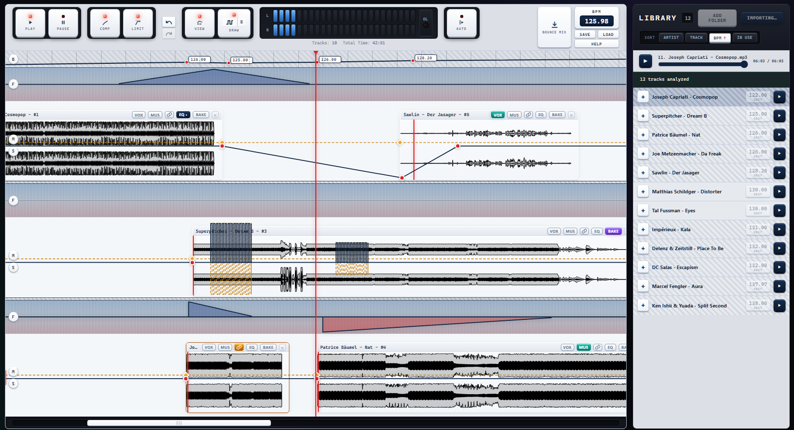
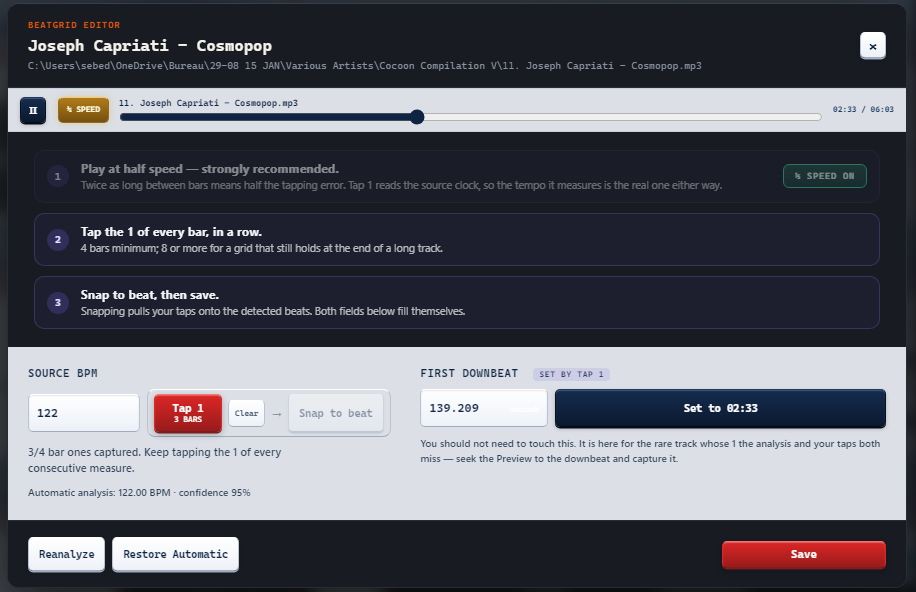
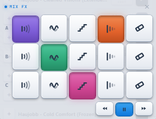
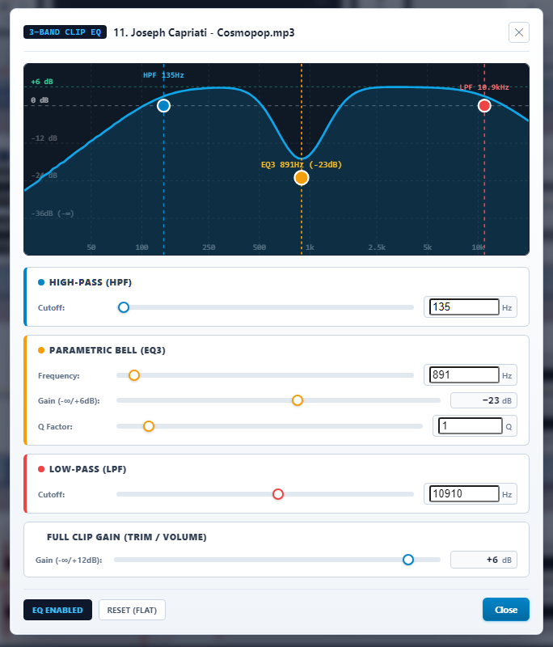
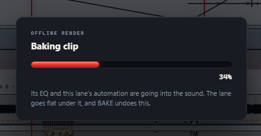

# MixCanvas

**Build DJ mixes with the precision of a timeline and the feel of a studio.**

MixCanvas is a free, open-source Windows application for creating complete DJ
mixes before the party starts. Import your own MP3s, correct the beatgrid when
needed, arrange tracks on a musical timeline, shape transitions with automation,
and play or export the finished mix.

It is deliberately focused: no streaming service, no account, no cloud library,
and no VST plugin ecosystem. Your music, your files, your computer.

## Why MixCanvas

Traditional DJ software is made for performing in the moment. MixCanvas is made
for refining a mix over time. Move a transition, hear it again, draw the change
you want, and keep editing while the timeline plays.

- Three stereo tracks on one beat-based timeline.
- Automatic BPM and downbeat analysis, with practical manual correction.
- Pitch-preserving time-stretching and a global tempo curve for beatmatched
  transitions.
- Four effects you play by hand while the mix runs, recorded onto the timeline.
- Local audio processing in 32-bit floating point.
- No subscriptions, no telemetry, and no network connection required.

*The full mix at a glance: musical timeline, visual transitions, live transport,
and Library in one workspace.*

## Core workflow

1. Add MP3s to the Library.
2. MixCanvas reads ID3 artist/title data, creates a waveform, and analyses BPM,
   beatgrid, and first downbeat in the background.
3. Preview a track, correct it in the Beatgrid Editor if required, then drag it
   onto the Timeline.
4. Arrange, beatmatch, automate, play, save, and bounce the finished mix.

## Library and beatgrid

- Import individual MP3 files, whole folders, or drag MP3s in from Explorer.
- Library display uses Artist – Track Title when metadata is available.
- Sort by BPM, artist, title, or timeline use; used tracks receive a visual
  overlay to prevent accidental duplicate additions.
- Per-track preview player with seekable waveform/progress control.
- Local automatic BPM, beat, downbeat, and waveform analysis.
- Beatgrid Editor with preview playback, manual BPM, half/double tempo tools,
  Tap 1 downbeat capture, Snap to Beat, and restoration of the automatic result.
- Manual corrections remain yours: re-analysis does not overwrite them.

*When automatic analysis needs help, the Beatgrid Editor makes the correction
audible, guided, and repeatable.*

## Musical timeline

- Three stereo lanes: A, B, and C.
- Drag-and-drop placement or one-click insertion into the next free lane.
- Beat/bar snapping keeps downbeats aligned while clips move horizontally or
  vertically — even during playback.
- Continuous zoom, full-project zoom-out, centered playhead follow, click-to-seek,
  and a horizontal navigator.
- Drag clips, trim either edge, split a clip, remove it, or undo/redo up to
  fifty edits.
- Floating Mute and Solo controls per lane.
- Global tempo map with draggable tempo targets. Between two targets the tempo
  moves in whole-beat steps rather than sliding continuously, so a tempo change
  lands on a beat where the transient hides it instead of drifting audibly.
- Right-click a tempo target to set the speed that clip plays at, without
  touching the track's analysed BPM.
- Every clip follows the project tempo through pitch-preserving stereo-linked
  time-stretching, rather than varispeed, across a safe 0.5×–2× range.
- Play/Pause transport, Spacebar control, optional Autoplay, and live timeline
  editing without pre-rendering the entire set.

## Automation and transitions

MixCanvas lets you draw transitions directly where they happen.

- Volume automation from −∞ dB to +12 dB.
- Pan automation with a constant-power pan law.
- Smart Filter automation: draw high-pass or low-pass sweeps as visual curves,
  reshape them, and remove them with a right click.
- **Nodes** are for exact, individual control points: place, move, or delete a
  specific value at a specific beat.
- **Draw** is for a complete musical gesture. Drag across a range to create a
  step, sine, or triangle Volume/Pan movement with its own period and shape.
  It appears as one clean curve, can be deleted in one action, and does not
  clutter the timeline with hundreds of visible nodes.
- Under the hood, Draw still preserves the detailed automation points required
  by the audio engine. The simplified line is only a clearer way to edit it.
- Automation belongs to the lane, not to the clip: it stays at the beats where
  you drew it when a clip moves. Removing a clip does clear the automation that
  was only its own, without touching a neighbour's.

## Play effects by hand

`MIX FX` opens a small panel over the Library column. Hold a pad while the mix
runs and the effect goes onto that track; let go and the pass is written onto
the timeline as automation you can keep, undo, or replay over.

  
   
  <em>Five pads per track, and the transport within reach. A pad lights while
  its effect is sounding — here reverb and delay on A, flange on B, crush on C.</em>

- **Reverb** — a shared room. Bright and generous, sitting well behind the
  music.
- **Flange** — a comb filter sweeping across the track, ping-ponging in stereo.
- **Crush** — eight-bit quantisation with sample-and-hold aliasing, replacing
  the track while you hold it.
- **Delay** — a dotted-eighth echo that follows the project tempo, so it stays
  on the beat even through a tempo ramp. It bounces from one ear to the other
  and each repeat comes back darker. Hold it, cut the track, and the echo
  carries the transition.
- Reverb, flange, and delay sit on sends, so their tails keep ringing after you
  release the pad. Crush sits inline, and the other three are taken after it —
  you hear the room around the crushed sound.
- The pass draws itself while you play it: a coloured band grows from where you
  pressed and follows the playhead. Purple for reverb, green for flange,
  magenta for crush, orange for delay. Where two overlap, the region is hatched
  in both colours.
- An eraser pad on each track wipes every effect it sweeps over, in one undoable
  step. The track falls silent under it as you go, so you hear what you are
  removing while you remove it.
- A pad lights whenever its effect is sounding — under your finger, or under the
  playhead when a recorded pass plays back.

## Sound and mix tools

- High-definition stereo waveform display with peak and RMS detail, adapted to
  the current zoom level.
- Three-band EQ on every clip, adjustable during playback.
- Sidechain compression: make a clip the key and let it pump overlapping clips.
- Master Glue Compressor with console colour/saturation.
- Stereo-linked master limiter and a real post-limiter OL overload lamp.
- Vintage stereo VU meters driven by the actual output signal.
- All decoding, time-stretching, automation, mixing, and processing run in
  float32 at the audio device's native sample rate.

| Per-clip EQ | Reversible Bake |
|---|---|
|  |  |
| Shape a clip while it plays. | Render a dense clip when you are ready, then undo it at any time. |

## Vocals, instrumentals, and baking

- Separate a clip into Vocals and Instrumental locally with Open-Unmix.
- Choose full track, vocals only, or instrumental only per clip.
- Separation only processes the part of the source used by the clip, not an
  entire song unnecessarily.
- BAKE renders a clip and its effects into a reusable audio file to lighten a
  dense mix. Baking is reversible and restores the automation it replaced.

## Save and export

- Save and load portable .mixcanvas projects.
- Bounce the complete mix to 16-bit / 44.1 kHz stereo WAV with TPDF dither.
- The original MP3 files are never modified.
- The Library only stores references and metadata, and warns when a source file
  was moved or is missing.

## Private and portable by design

MixCanvas makes no network request. BPM detection, waveform generation, vocal
separation, and all audio processing run on your machine.

Everything MixCanvas creates lives in MixCanvas Files beside the executable:
the database, extracted resources, separated stems, baked clips, and project
media. Copy the executable and that folder to move your setup. Your original
MP3s always stay where you put them.

### Windows requirement

MixCanvas uses the **Microsoft Edge WebView2 Runtime** to display its interface.
It is already included with Windows 11 and most supported Windows 10 systems.
If it has been removed or is unavailable, install the
[WebView2 Runtime](https://developer.microsoft.com/en-us/microsoft-edge/webview2/).
You do not need to install or use the Microsoft Edge browser itself.

The portable build uses software drawing by default for visual stability on
Windows systems where WebView2 GPU compositing can show artifacts. Audio remains
native Rust processing in every render mode. Advanced launch flags are available:

| Flag | Render mode |
|---|---|
| *(none)* or --no-gpu | software rendering (default) |
| --gpu-safe | GPU drawing with software compositing |
| --gpu | full GPU rendering |

## Build from source

Requirements: Windows, Node.js with Corepack, the Rust toolchain specified by
rust-toolchain.toml, Microsoft C++ Build Tools with **Desktop development with
C++**, and Microsoft Edge WebView2.

    .\install.cmd     # installs project-local dependencies
    .\dev.cmd         # runs the development build
    .\check.cmd       # TypeScript, frontend tests, Rust tests, fmt, and Clippy

Dependencies and caches remain inside the repository: pnpm does not need to be
installed globally and the project does not modify your PATH. The beat-tracking
models are included, so a fresh clone can analyse music without downloading
anything at first launch.

Close MixCanvas before running check.cmd: Windows locks the bundled ONNX Runtime
DLL while the app is open.

Create a single-file portable build with:

    npx tauri build --no-bundle -f embed-resources

The embed-resources feature packages the interface, analysis models, and ONNX
Runtime into the executable.

## Technology

- Tauri 2, React, TypeScript, and Rust.
- SQLite for the local Library, Timeline, and automation data.
- Symphonia/Rodio for decoding and CPAL for native audio output.
- Beat This! for beat/downbeat analysis and Open-Unmix for stem separation.

For implementation details and design decisions, see
[architecture.md](architecture.md). The architecture notes and source comments
are written in French.

## License

MixCanvas is released under the
[GNU AGPL v3.0 only](LICENSE) (AGPL-3.0-only). You may use, study, share, and
modify it. If you distribute a modified version — including as a network service
— you must make its corresponding source available under the same license.

See [THIRD_PARTY_NOTICES.md](THIRD_PARTY_NOTICES.md) for notices and checksums
for bundled models and binaries.
